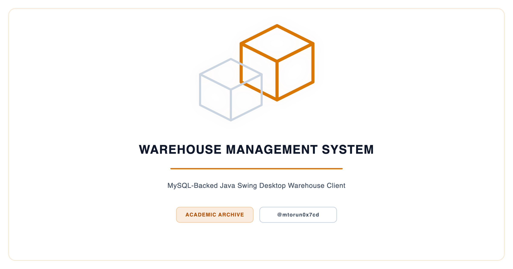
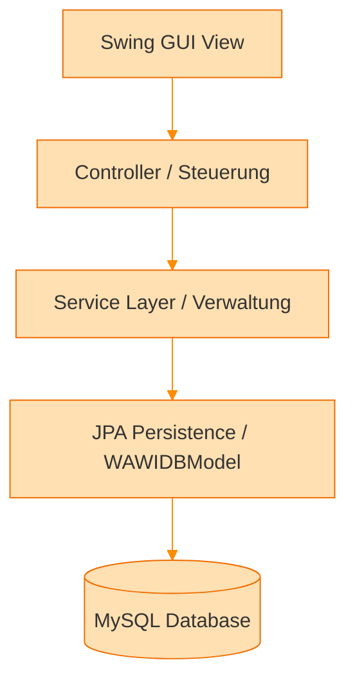
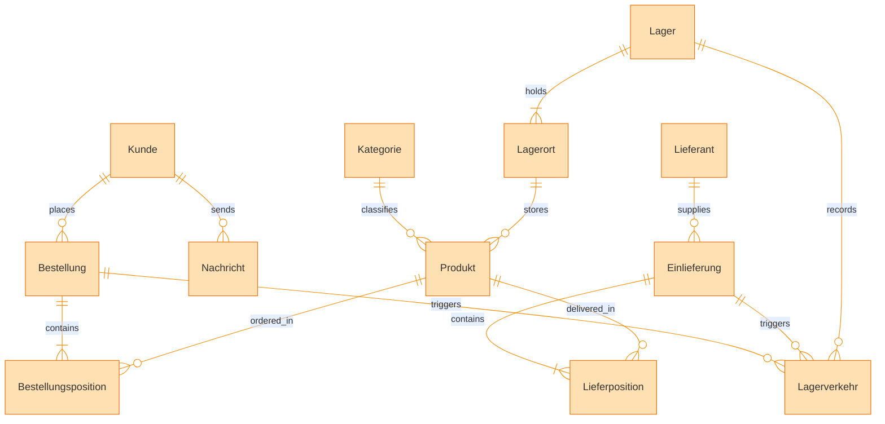

<p align="center">
  <picture>
    <source media="(prefers-color-scheme: dark)" srcset="docs/social_preview_dark.png" />
    <source media="(prefers-color-scheme: light)" srcset="docs/social_preview_light.png" />
    
  </picture>
</p>

# Warehouse Management System (WAWI)

> Multi-tier Java desktop application for warehouse and inventory management with role-based access control, 14-component modular architecture, and JPA persistence.

[](https://github.com/mtorun0x7cd/warehouse-management-system/actions/workflows/ci.yml)


> **Archived.** A frozen record of completed work, preserved for reference and not actively maintained. See [`SECURITY.md`](SECURITY.md) for scope and disclosures.

---

## Overview

WAWI (Warenwirtschaft) is a multi-tier desktop application for managing warehouse operations, product inventories, customer orders, supplier deliveries, and internal messaging. The system applies a layered Model-View-Controller pattern to a realistic warehouse management domain, enforcing strict separation of concerns across 14 component modules.

The application supports four distinct user roles — Administrator, Customer (Kunde), Warehouse Keeper (Lagerhalter), and Clerk (Sachbearbeiter) — each with a dedicated GUI (presentation) and Steuerung (control) layer, backed by shared Verwaltung (data-management) and persistence components. A central Bootloader component handles authentication and session management with internationalization (i18n) support for German and English locales. A ComponentController coordinates the lifecycle of all role-specific modules via a unified `IActivateComponent` activation interface.

The persistence layer uses JPA via EclipseLink 2.7.9 (the `persistence.xml` descriptor targets the JPA 2.0 schema), mapping 12 entity classes to a MySQL backend, with separate persistence units for development and production environments. JUnit test suites cover the Verwaltung (service) and Steuerung (controller) layers.

## Context

| Dimension | Detail |
| :--- | :--- |
| **Institution** | TH Köln (Cologne University of Applied Sciences) |
| **Program** | Technische Informatik (Technical Computer Science), B.Sc. |
| **Course** | Software-Praktikum (Software Lab) (SWP) |
| **Semester** | Summer 2019 |
| **Type** | Team |

## Features

- **Role-based access control** — four user roles (Admin, Kunde, Lagerhalter, Sachbearbeiter) with isolated module stacks
- **Component-based activation** — each role activates only its required modules via `IActivateComponent` interface
- **Customer order management** — order creation, status tracking, and order history for customers and clerks
- **Warehouse inventory tracking** — stock movements, warehouse locations, and delivery management
- **Supplier delivery processing** — inbound delivery tracking with line-item granularity (Einlieferung, Lieferposition)
- **Internal messaging system** — bidirectional messaging with status tracking (Nachricht entities)
- **Dual persistence units** — separate JPA configurations for development and production environments
- **Internationalization (i18n)** — German and English locale bundles via `Bundle.properties`
- **Swing GUI with data binding** — BeansBinding framework for reactive UI updates
- **JUnit test coverage** — automated tests for Verwaltung and Steuerung layers

## Architecture

### Layered MVC Pattern

The system enforces strict separation of concerns through four architectural layers:

```text
┌─────────────────────────────────────────────────────┐
│                   Presentation (GUI)                │
│         Swing-based role-specific interfaces        │
├─────────────────────────────────────────────────────┤
│               Business Logic (Steuerung)            │
│    Boundary classes, enums, service interfaces      │
├─────────────────────────────────────────────────────┤
│              Data Management (Verwaltung)           │
│         CRUD operations, domain services            │
├─────────────────────────────────────────────────────┤
│              Persistence (WAWIDBModel)              │
│      JPA entities, EntityManager, named queries     │
└─────────────────────────────────────────────────────┘
                         │
                    ┌────┴────┐
                    │  MySQL  │
                    └─────────┘
```

#### Tier Architecture Flowchart



### 14-Component Architecture

The system comprises 14 components: four presentation (GUI), four control (Steuerung), three data-management (Verwaltung), and three cross-cutting components. Each role maps to a vertical slice through the role-specific layers.

| Layer | Admin | Kunde (Customer) | Lagerhalter (Warehouse) | Sachbearbeiter (Clerk) |
| ------- | ------- | ------------------- | ------------------------- | ------------------------ |
| **GUI** | AdminGUI | KundeGUI | LagerhalterGUI | SachbearbeiterGUI |
| **Steuerung** | AdminSteuerung | KundeSteuerung | LagerhalterSteuerung | SachbearbeiterSteuerung |
| **Verwaltung** | — | KundeVerwaltung, BestellungVerwaltungK | — | BestellungVerwaltungS |

The Admin and Lagerhalter roles in this archive provide the presentation and control layers; their dedicated data-management components are not part of this distribution.

**Cross-cutting components:**

| Component | Purpose |
| ----------- | --------- |
| **WAWIDBModel** | JPA entity model with 12 entities (Bestellung, Kunde, Produkt, Lager, Nachricht, etc.), persistence units, and database access layer |
| **Bootloader** | Login/logout GUI, authentication logic, session management, i18n resource bundles |
| **ComponentController** | Component lifecycle management, role-based activation/deactivation via `IActivateComponent` interface |

### Data Model

The JPA persistence layer maps 12 entity classes to MySQL:

- **Bestellung** / **Bestellungsposition** — Orders and line items
- **Kunde** — Customer accounts
- **Produkt** / **Kategorie** — Product catalog with categories
- **Lager** / **Lagerort** / **Lagerverkehr** — Warehouse locations and stock movements
- **Lieferant** / **Lieferposition** / **Einlieferung** — Supplier deliveries
- **Nachricht** — Internal messaging system

#### Entity-Relationship Diagram (ERD)



## Tech Stack

| Category | Technologies |
| ---------- | ------------- |
| Language | Java 11 |
| Build | Maven (assembly plugin, executable fat JAR) |
| GUI Framework | Java Swing, BeansBinding |
| ORM | JPA 2.0 (persistence.xml) / EclipseLink 2.7.9 |
| Database | MySQL 8.0 |
| Connector | MySQL Connector/J 8.4.0 |
| Testing | JUnit 4 |
| Architecture | Multi-tier MVC, Component-based |

## Project Structure

```text
warehouse-management-system/
├── src/
│   ├── AdminGUI/                  # Admin role presentation layer
│   ├── AdminSteuerung/            # Admin role business logic
│   ├── BestellungVerwaltungK/     # Customer order data management
│   ├── BestellungVerwaltungS/     # Clerk order data management
│   ├── Bootloader/                # Authentication & application entry point
│   ├── ComponentController/       # Module lifecycle coordination
│   ├── KundeGUI/                  # Customer role presentation layer
│   ├── KundeSteuerung/            # Customer role business logic
│   ├── KundeVerwaltung/           # Customer CRUD data management
│   ├── LagerhalterGUI/            # Warehouse keeper presentation layer
│   ├── LagerhalterSteuerung/      # Warehouse keeper business logic
│   ├── SachbearbeiterGUI/         # Clerk role presentation layer
│   ├── SachbearbeiterSteuerung/   # Clerk role business logic
│   └── WAWIDBModel/               # JPA entities & persistence layer
└── docs/                          # Architecture and specification documents
```

## Getting Started

### Prerequisites

- Java JDK 11+
- Apache Maven 3.6+
- MySQL 8.0, reachable on `localhost:3306` (required for persistence and the test suite)

### Database Setup

The persistence layer is configured in `src/WAWIDBModel/src/META-INF/persistence.xml`, which defines two `RESOURCE_LOCAL` persistence units — `WAWIDBDEVPU` (development) and `WAWIDBPRODPU` (production). Both default to a local MySQL instance:

```text
jdbc:mysql://localhost:3306/wawidb   (user: root, password: wawipassword)
```

EclipseLink is configured with `drop-and-create-tables`, so the schema is generated automatically on first run. Adjust the `javax.persistence.jdbc.*` properties to target a different database. The default credentials are intended for a disposable local instance only and must not be reused in any real deployment.

Provision the database expected by the defaults:

```bash
mysql -u root -p -e "CREATE DATABASE IF NOT EXISTS wawidb;"
```

### Build & Run

The build is driven by Maven. The assembly plugin produces a self-contained executable JAR whose manifest entry point is `wawi.gui.bootloader.gui.LoginGUI`:

```bash
mvn clean package
java -jar target/warehouse-management-system-1.0.0-jar-with-dependencies.jar
```

`mvn clean package` runs the JUnit suites, which require a reachable MySQL instance matching `WAWIDBDEVPU`. To build without a database, skip the tests:

```bash
mvn clean package -DskipTests
```

## Documentation

| Document | Description |
| ---------- | ------------- |
| [WAWI_Grobentwurf.pdf](docs/WAWI_Grobentwurf.pdf) | System architecture and rough design |
| [WAWI_Kunde_AF_Tabelle.pdf](docs/WAWI_Kunde_AF_Tabelle.pdf) | Use case table for the Kunde (Customer) domain |
| [WAWI_Kunde_CD.pdf](docs/WAWI_Kunde_CD.pdf) | Class diagram for the Kunde (Customer) domain |
| [WAWI_Lastenheft.pdf](docs/WAWI_Lastenheft.pdf) | Requirements specification |
| [WAWI_SystemSpez.pdf](docs/WAWI_SystemSpez.pdf) | System specification |
| [WAWI_Testspezifikation.pdf](docs/WAWI_Testspezifikation.pdf) | Test specification |
| [WAWI_Integrationstest.pdf](docs/WAWI_Integrationstest.pdf) | Integration test specification |

## References

[1] E. Gamma, R. Helm, R. Johnson, and J. Vlissides, "Design Patterns: Elements of Reusable Object-Oriented Software," Addison-Wesley, 1994.

[2] JSR 317: Java Persistence API 2.0 Specification, Oracle, 2009. [https://jcp.org/en/jsr/detail?id=317](https://jcp.org/en/jsr/detail?id=317)

[3] C. Szyperski, "Component Software: Beyond Object-Oriented Programming," Addison-Wesley, 2002.

## Citation

Citation metadata is provided in [`CITATION.cff`](CITATION.cff); GitHub renders a *Cite this repository* action from it.

## Security

This is an archived project and is not actively maintained. See [`SECURITY.md`](SECURITY.md) for its support status and a note on the default development credentials.

## License

This project is licensed under the MIT License — see the [LICENSE](LICENSE) file for details.

## Author

**Mert Torun, M.Sc.** — IT Security Architect & Systems Engineer  
mtorun0x7cd · Research & Development

His work spans the verification and validation of safety-critical systems, infrastructure hardening, and cryptographic integrity, grounded in an M.Sc. in Computer Science and Systems Engineering from TH Köln. This repository is preserved as a record of a completed project rather than maintained as a living tool.

- **Email**: [info@mtorun0x7cd.com](mailto:info@mtorun0x7cd.com)
- **Website**: [mtorun0x7cd.com](https://mtorun0x7cd.com)
- **LinkedIn**: [linkedin.com/in/mtorun0x7cd](https://linkedin.com/in/mtorun0x7cd)
- **GitHub**: [github.com/mtorun0x7cd](https://github.com/mtorun0x7cd)
